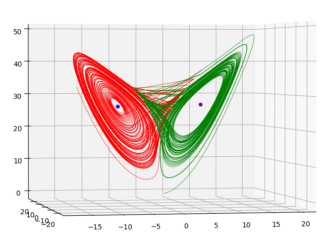
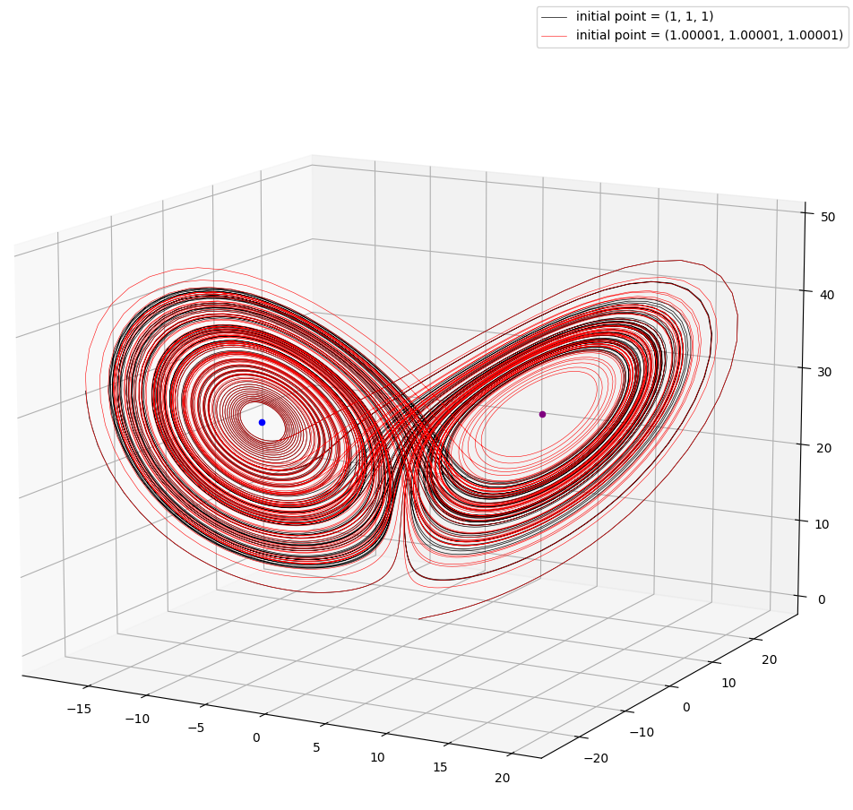
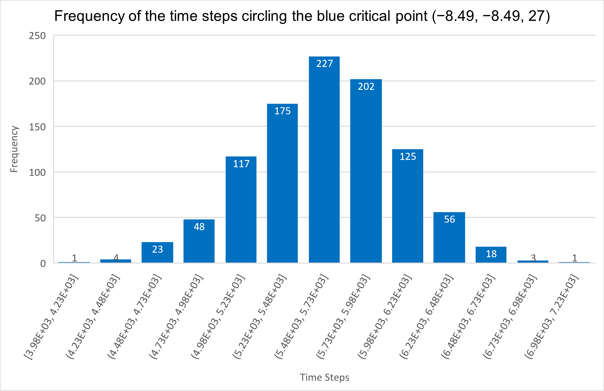
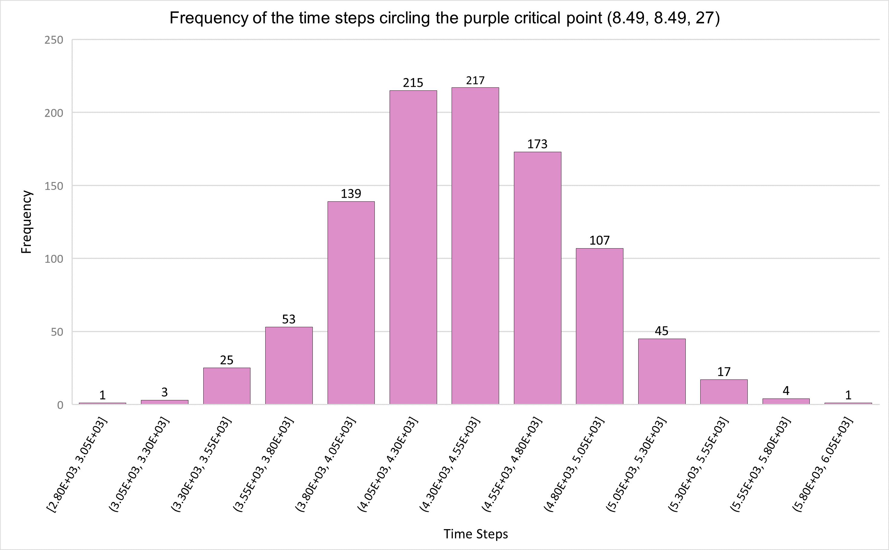

# Lorenz-Attractor

This is the final personal project  for Computational Problem Solving for Engineers

* The goal is to analyze the chaotic time series  behavior in Lorenz attractor with the help of [**HTCondor**](https://userguide.its.cit.cmu.edu/services/software/condor/) resources provided by Carnegie Mellon University, [**Bridge-2**](https://www.psc.edu/resources/bridges-2/), a supercomputer at Pittsburgh Supercomputing Center, and [**PySpark**](https://spark.apache.org/docs/latest/api/python/#), an interface for Apache Spark in Python
* All the details can be found in [report.pdf](report.pdf)

## Demonstration 

* For the first part of this report, I demonstrated the butterfly-like curve of Lorenz attractor and its chaotic behavior of responding to an infinitesimal change in the initial point

1. The Butterfly-like curve of Lorenz attractor (Implemented by [lorenz1.py](lorenz1.py))

  
  

2. Chaotic behavior of Lorenz attractor (Implemented by [lorenz2.py](lorenz2.py))

  

> The red curve and black curve in the above image depict two different Lorenz systems resulting 0.00001 difference between the initial point.

* For the second part, I employed **HTCondor** to run [lorenz3.py](lorenz3.py) **1000** times concurrently, each run simulates a Lorenz attractor for **10000** time steps with a perturbed starting point computed by adding random numbers varied between 0 and 0.3 to (1, 1, 1). The results of each simulation were saved to a CVS file.

* Then, I utilized **PySpark** and **Bridge-2** to analyze and process these **1000** CSV files in parallel for computing the averaged time steps and the total time steps taken by the simulated Lorenz attractors while circling the critical points (One is at (–8.49, –8.49, 27) and the other is at (8.49, 8.49, 27)).

3. The average time steps taken by 1000 simulated Lorenz attractors while circling the points

Critical point | Mean | Variance | Standard Deviation
--- | --- | --- | ---  
(-8.49, -8.49, 27)| 5616.93 | 196316| 443.076
(8.49, 8.49, 27) |  4383.07 |196257 |443.009

4. The histogram displaying the frequency of the total number of time steps the simulated Lorenz attractors took while circling the critical point at (–8.49, –8.49, 27) 

  

5. The histogram displaying the frequency of the total number of time steps the simulated Lorenz attractors took while circling the critical point at (–8.49, –8.49, 27) 

  

